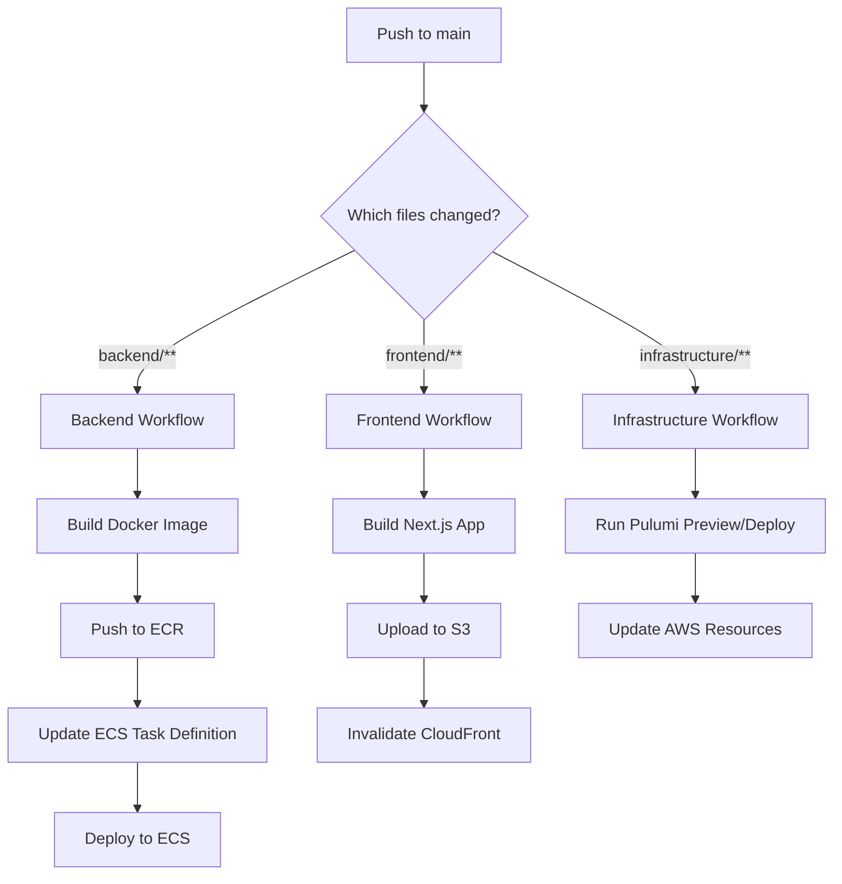

# CI/CD Setup Guide

This guide explains how to set up GitHub Actions for automatic deployments when you push changes to your Words Wall application.

## 🚀 How It Works

The CI/CD pipeline automatically deploys different parts of your application based on which files you change:

### 📂 **Trigger Paths**

| **Files Changed** | **Workflow Triggered** | **What Gets Deployed** |
|------------------|------------------------|------------------------|
| `backend/**` | `deploy-backend.yml` | Backend application to ECS |
| `infrastructure/task-definitions/**` | `deploy-backend.yml` | Backend task definition updates |
| `frontend/**` | `deploy-frontend.yml` | Frontend to S3 + CloudFront |
| `infrastructure/**` (except backend) | `deploy-infrastructure.yml` | AWS infrastructure via Pulumi |

### 🔄 **Deployment Flows**



## 🔐 Required GitHub Secrets

You need to set up these secrets in your GitHub repository:

### AWS Credentials
```
AWS_ACCESS_KEY_ID=AKIA...
AWS_SECRET_ACCESS_KEY=...
```

### Pulumi Access Token
```
PULUMI_ACCESS_TOKEN=pul-...
```

## 📋 Setting Up GitHub Secrets

### 1. Create AWS IAM User for GitHub Actions

```bash
# Create IAM user
aws iam create-user --user-name github-actions-words-wall

# Create access key
aws iam create-access-key --user-name github-actions-words-wall
```

### 2. Attach Required Policies

The GitHub Actions user needs these permissions:

```json
{
  "Version": "2012-10-17",
  "Statement": [
    {
      "Effect": "Allow",
      "Action": [
        "ecr:GetAuthorizationToken",
        "ecr:BatchCheckLayerAvailability",
        "ecr:GetDownloadUrlForLayer",
        "ecr:BatchGetImage",
        "ecr:InitiateLayerUpload",
        "ecr:UploadLayerPart",
        "ecr:CompleteLayerUpload",
        "ecr:PutImage"
      ],
      "Resource": "*"
    },
    {
      "Effect": "Allow",
      "Action": [
        "ecs:RegisterTaskDefinition",
        "ecs:UpdateService",
        "ecs:DescribeServices",
        "ecs:DescribeTaskDefinition"
      ],
      "Resource": "*"
    },
    {
      "Effect": "Allow",
      "Action": [
        "s3:PutObject",
        "s3:PutObjectAcl",
        "s3:GetObject",
        "s3:DeleteObject",
        "s3:ListBucket"
      ],
      "Resource": [
        "arn:aws:s3:::words-wall-*",
        "arn:aws:s3:::words-wall-*/*"
      ]
    },
    {
      "Effect": "Allow",
      "Action": [
        "cloudfront:CreateInvalidation"
      ],
      "Resource": "*"
    },
    {
      "Effect": "Allow",
      "Action": [
        "logs:CreateLogGroup",
        "logs:CreateLogStream",
        "logs:PutLogEvents",
        "logs:DescribeLogGroups",
        "logs:DescribeLogStreams",
        "logs:GetLogEvents"
      ],
      "Resource": "*"
    },
    {
      "Effect": "Allow",
      "Action": "iam:PassRole",
      "Resource": [
        "arn:aws:iam::*:role/words-wall-*-ecs-execution-role",
        "arn:aws:iam::*:role/words-wall-*-ecs-task-role"
      ]
    }
  ]
}
```

### 3. Add Secrets to GitHub

1. Go to your GitHub repository
2. Click **Settings** → **Secrets and variables** → **Actions**
3. Click **New repository secret**
4. Add each secret:

```
Name: AWS_ACCESS_KEY_ID
Value: AKIA... (from step 1)

Name: AWS_SECRET_ACCESS_KEY  
Value: ... (from step 1)

Name: PULUMI_ACCESS_TOKEN
Value: pul-... (from Pulumi dashboard)
```

## 🎯 Workflow Details

### Backend Deployment (`deploy-backend.yml`)

**Triggers on:**
- Changes to `backend/**`
- Changes to `infrastructure/task-definitions/**`

**What it does:**
1. Builds Docker image with `--platform linux/amd64`
2. Pushes to ECR with git SHA tag + latest
3. Updates ECS task definition with new image
4. Deploys to ECS service
5. Waits for deployment stability
6. Shows recent logs

### Frontend Deployment (`deploy-frontend.yml`)

**Triggers on:**
- Changes to `frontend/**`

**What it does:**
1. Gets infrastructure outputs from Pulumi (S3 bucket, CloudFront ID, ALB DNS)
2. Builds Next.js app with correct API endpoint
3. Uploads static files to S3
4. Invalidates CloudFront cache
5. Shows deployment URLs

### Infrastructure Deployment (`deploy-infrastructure.yml`)

**Triggers on:**
- Changes to `infrastructure/**` (except task definitions and backend deploy script)

**What it does:**
1. **Pull Requests**: Runs `pulumi preview` to show changes
2. **Main branch**: Runs `pulumi up` to deploy changes
3. Exports infrastructure outputs
4. Checks if task definition ARNs need updates

## 🧪 Testing Your Setup

### 1. Test Backend Deployment

```bash
# Make a small change to backend
echo "// Updated $(date)" >> backend/src/main.ts

# Commit and push
git add backend/src/main.ts
git commit -m "test: trigger backend deployment"
git push origin main
```

Watch the GitHub Actions tab to see the backend workflow run.

### 2. Test Frontend Deployment

```bash
# Make a small change to frontend
echo "/* Updated $(date) */" >> frontend/src/app/globals.css

# Commit and push
git add frontend/src/app/globals.css
git commit -m "test: trigger frontend deployment"
git push origin main
```

### 3. Test Infrastructure Deployment

```bash
# Make a small change to infrastructure
echo "// Updated $(date)" >> infrastructure/index.ts

# Commit and push
git add infrastructure/index.ts
git commit -m "test: trigger infrastructure deployment"
git push origin main
```

## 🔍 Monitoring Deployments

### GitHub Actions Dashboard

1. Go to your repository → **Actions** tab
2. See all workflow runs and their status
3. Click on any run to see detailed logs
4. Green ✅ = successful, Red ❌ = failed

### AWS Monitoring

```bash
# Check ECS service status
aws ecs describe-services --cluster words-wall-production-cluster --services words-wall-backend-service

# View backend logs
aws logs tail /ecs/words-wall-backend --follow

# Check CloudFront invalidations
aws cloudfront list-invalidations --distribution-id YOUR_DISTRIBUTION_ID
```

## 🚨 Troubleshooting

### Common Issues

**1. Backend deployment fails with "Task failed to start"**
```bash
# Check ECS service events
aws ecs describe-services --cluster words-wall-production-cluster --services words-wall-backend-service --query 'services[0].events'

# Check task definition
aws ecs describe-task-definition --task-definition words-wall-backend-task
```

**2. Frontend deployment fails with "Bucket not found"**
- Ensure infrastructure is deployed first
- Check Pulumi outputs: `cd infrastructure && pulumi stack output`

**3. Infrastructure deployment fails**
- Check Pulumi access token is valid
- Verify AWS permissions for the GitHub Actions user
- Review Pulumi logs in GitHub Actions

**4. ECR push fails with "Access denied"**
```bash
# Check ECR permissions
aws ecr describe-repositories --repository-names words-wall-backend
```

### Manual Recovery

If GitHub Actions fail, you can always deploy manually:

```bash
# Backend
cd infrastructure
npm run backend:build-deploy

# Frontend  
npm run frontend:deploy

# Infrastructure
npm run infra:deploy
```

## 🎉 Benefits of This Setup

1. **🚀 Automatic Deployments**: Push code → Automatic deployment
2. **🎯 Smart Triggering**: Only deploys what changed
3. **🔒 Secure**: Uses IAM roles and GitHub secrets
4. **📋 Visibility**: Full deployment logs in GitHub
5. **🔄 Rollback Ready**: Easy to revert with git
6. **⚡ Fast**: Backend deployments ~5-10 minutes
7. **🛡️ Safe**: Pull request previews for infrastructure changes

Now when you push any changes to your repository, GitHub Actions will automatically build and deploy the appropriate components! 🚀